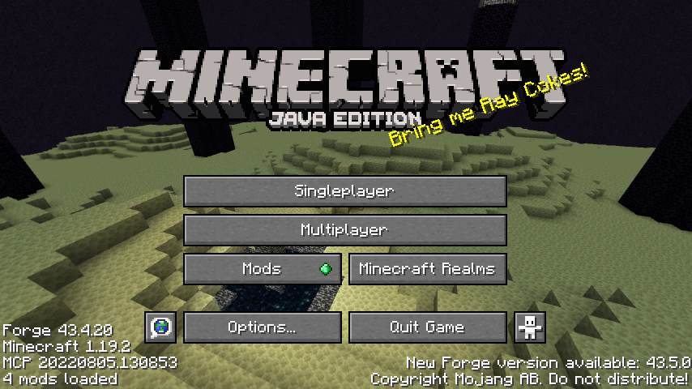

# Panoramic Screenshot


A client mod, allows you to take high resolution normal/panoramic/skybox screenshots.

Use `/screenshot` to take a specified type of screenshot. Also supports set a shortcut key to take panoramic or skybox screenshots.

## Feature Details

### `/screenshot normal <width> <height>`
Take a normal screenshot with the specified resolution. Max to 16384 * 16384.

### `/screenshot panoramic <mode>`
Shoter form of the command below, will use default parameters.
This is what the shortcut key actually calls.
Default parameters are:
- `height`: your current screen height
- `fov`: your current FOV
- `yaw_start`: 0
- `frame_delay`: 0

### `/screenshot panoramic <mode> <height> <fov> <yaw_start> <frame_delay>`
Take a panoramic screenshot that around yourself, like the title image.

Implementation method is to rotate the perspective 360° and take screenshots repeatedly, and stitch them.

Parameters:
- `mode`: one of `FAST` and `PRECISE`, `FAST` will take 360 screenshots while `PRECISE` take one screenshot each column of pixels.
`FAST` mode have some flaws when fov larger than 60°. So `PRECISE` mode is recommended.
- `height`: height of the final screenshot, in pixels, the width will be calculated by `height/fov * 360`.
- `fov`: field of view when taking screenshots, in degrees.
- `yaw_start`: the starting yaw when taking screenshots, in degrees. 0 means facing south, 90 means facing west.
- `frame_delay`: delay between each screenshot, in frames.

### `/screenshot skybox <name> <size>`
Take a skybox screenshot, which is a 6-face cubemap. Like Minecraft title screen background.

In fact you can custom title screen with those skybox screenshots.

Parameters:
- `name`: the file name of screenshots, form `<name>_0.png` to `<name>_5.png`.
- `size`: the width and height, in pixels.

### Custom Title Screen Background



#### Prue Vanilla Resource Pack
Just put skybox screenshots in `minecraft/textures/gui/title/background` and name them `panorama_0.png` to `panorama_5.png`.

#### With this mod
This mod allows multiple skyboxes exist, and load one randomly at a time.

Put skybox screenshot in `{namespace}/textures/gui/title/background`, and create a metadata file named `{name}.json` in the same folder, with content like this:
```json
{
  "name": "{name}",
  "weight": 1
}
```
The directory should looks like:
```
  \{namespace}
    \textures
      \gui
        \title
          \background
            {name}_0.png
            {name}_1.png
            {name}_2.png
            {name}_3.png
            {name}_4.png
            {name}_5.png
            {name}.json
```
Mod will load all metadata and pick one randomly by the weight each time.

